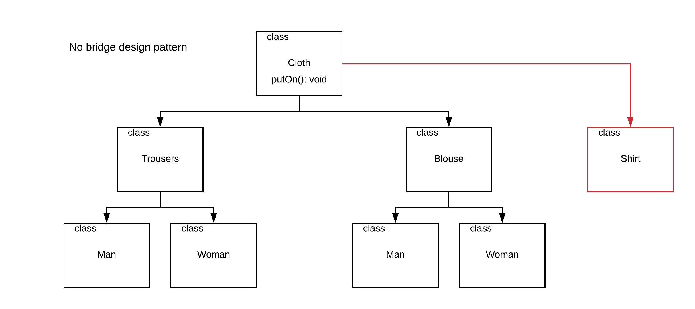
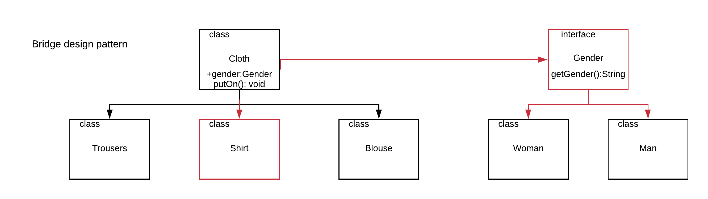

Bridge adapter design pattern ne zaman kullanılır?
============================

- Şekildeki UML'de bir class hiyerarşisindeki temel sıkıntı şöyle ifade edilebilir: Örneğin yeni bir kıyafet çeşidi eklendiğini düşünelim.(Shirt)

Hem kıyafet için hem de altında bulunacak 2 cinsiyet classı için implementasyon gerekecektir. 

Diğer bir problem ise yeni bir cinsiyet çeşidi eklendiğinde (NoGender gibi) bunu her kıyafet classının altına eklenecek olmasıdır.

Bu 2 temel problem aslında SOLID prensiplerinin O maddesine aykırıdır.(Open-Closed) Yani kodumuz değişime açık olmuş oluyor.
Bridge design pattern bu problemleri çözer.

